# Armtrak

You are going to be told about a game, and a machine that turns intention into livable experiences.

## The Interface

A 2D map, around 3000x3000 pixels.

The theme is space, stars, ships.

Players move freely in all directions.

Local or remote images are placed on the map.

The players decide what images to upload.

Images appear on top of existing images when layered.

The oldest images get removed when new ones get added.

Players decide where on the map to place the images by traveling there.

They go through images, on top, around, near, far.

There are over 10 types of lasers for players to attack.

They can attack other players to score and to upgrade.

Each kill upgrades a stat (health, speed, laser).

Uploading images also upgrade a stat depending on the dominant color (red, blue, green).

Live music can be set to play in the moment, like live battle music (which all players hear at the same time), which is searched on a video repository site through a command in the chat.

Players can AFK (away from keyboard) anywhere on the map as long as they have full health.

When players AFK they become invisible and unmovable.

There is global and local chat tabs for text chat.

Global chat is universal, all players can read and write.

Local chat is for nearby players, AFK or not.

In the center of the map there is a circle called the Safe Zone.

While in the Safe Zone, players get no damage and they can't attack.

The image of the Safe Zone changes every day. Every monday is a certain image, every sunday is a certain image, etc. This can be 7 stages of something, like a person: When they're old, young, and other differences.

The safe zone can be opened and closed with a single laser hit. When it is open, it has a green border and ships can enter. When it is closed, it has a red border and ships bounce when trying to enter. The charged laser and bombs always bounce off the safe zone at an angle.

Ships regenerate health automatically, but while on the safe zone they regen faster.

On laser upgrades, the laser given to a player is random, it can be any one from the array of available lasers. This excludes certain lasers like charged, skull, and single.

There are 4 warps that appear randomly on the map every certain amount of minutes. They can be used or destroyed. On every iteration they are replaced and renewed. When used, they act as portals that move the ship to a certain location on the map. When destroyed they stop working as portals, and instead reflect lasers shot at them.

When players reach a certain kill streak (like destroying 10 players without dying), they get to be the Skull. They get a certain icon status and a special laser. Players stop being the skull when they are destroyed.

When ships are destroyed they are resetted to the initial stats.

Ships have acccess to a boost to temporarily boost their speed until it depletes.

The boost regenerates automatically.

When boosting, ships have a chance of reflecting attacks thrown at them.

There are 19 ship models that players can select at any time. This is just how the ship looks.

There is an image viewer to quickly see the uploaded images without having to travel to them.

There is a minimap that shows the location of other ships, images, safe zone, and warps.

It's possible to drag the map and minimap with the mouse to inspect how zones look without having to travel to them.

It's also possible to zoom in or out, to change how you view the map.

The opacity of the images can be changed from 0% opacity to 100% opacity. More transparent images can make it easier on the eyes.

There are 3 views, map | minimap | full.

When on low health, players can keep Enter pressed to self-destruct.

On self-destruct, players explode and cause area of effect damage to other nearby players.

Effects show as icons next to player names, like confusion, freeze, and burn.

## Lasers

### Single

One laser. The weakest weapon. Not the default one, as this is actually given as punishment for entering the safe zone when damaged.

Units: 1 | Damage: 12

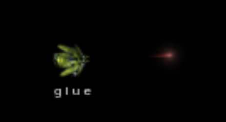

### Double

This is the default weapon. Two lasers. One on the left, one on the right.

Units: 2 | Damage: 12

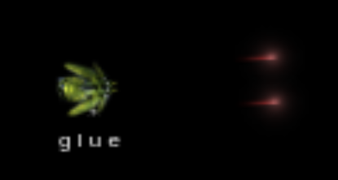

### Triple

Three lasers in a single line. Faster speed than usual. Like a triple shot.

Units: 3 | Damage: 12 | Faster

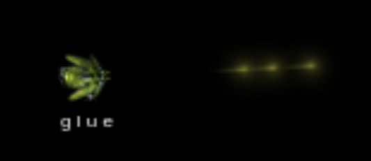

### Quad

Four lasers. Two in the front (left/right) and two in the sides with an angle (More to the left, and more to the right).

Units: 4 | Damage: 12

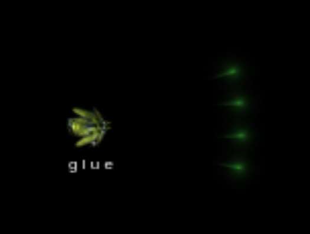

### Big

This makes enemy ships bigger. While bigger, their attacks are also bigger and they do more damage. While the laser itself does damage, it is kind of a blessing to the enemy as it becomes temporarily more powerful.

Units: 1 | Damage: 20 | Effect: Big

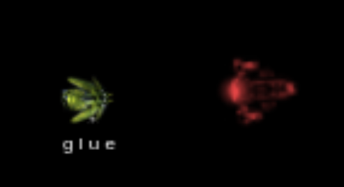

### Ripple

Animated. Two lasers that move in an axis (up/down).

Units: 4 | Damage: 12 | Dynamic

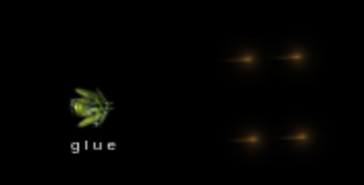

### Bomb

A laser that moves and then explodes after a certain distance. Area of effect damage.

Units: 1 | Damage: 100 | AoE

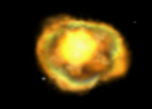

### Mirror

A laser that shoots from the front and from the back. Can be used to attack enemies behind.

Units: 2 | Damage: 12 | Bidirectional

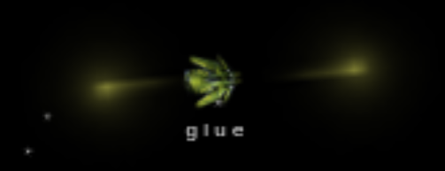

### Freeze

Temporarily slows down enemies.

Units: 1 | Damage: 12 | Effect: Freeze

### Confusion

Temporarily switches the direction of left and right controls for the enemy. Left becomes right, and right becomes left. When a warp is destroyed while carrying this laser, it becomes hostile and causes players to explode when touching it. This laser changes color automatically as it moves.

Units: 1 | Damage: 12 | Effect: Confusion

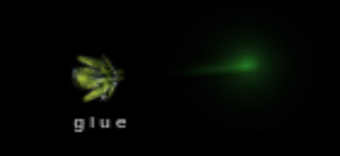

### Flame

A constant flame-thrower that causes burn damage. It can be stacked to make it stronger.

Units: Stack | Damage: 7 | Effect: Burn | Melee

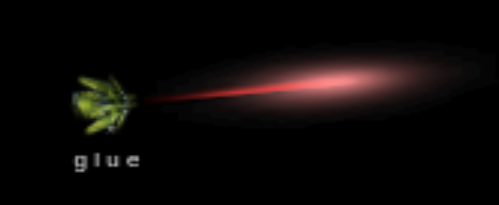

### Blade

A close distance melee weapon with three cores, that causes the ship to rotate and hit enemies with a blade if they come in contact, causing burn damage. When used it propels the player forward a short distance.

Units: 3 | Damage: 7 | Effect: Burn | Melee

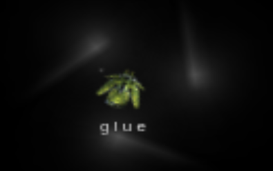

### Spores

Three lasers that move and disperse randomly. They can go through warps and appear elsewhere on the map.

Units: 3 | Damage: 12 | Faster | Warpable | Unpredictable Movement | Dynamic

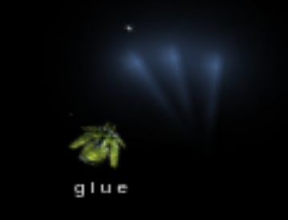

### Mines

Balls that are left on the player's trail as they move, placed on the map, unmoved. Many can be placed at the same time and they disappear automatically after a certain time. When enemies touch a mine they explode. The mines can be destroyed as well.

Units: Unlimited | Damage: 100 | Placed | Explosive | Destructible | AoE | Auto Remove

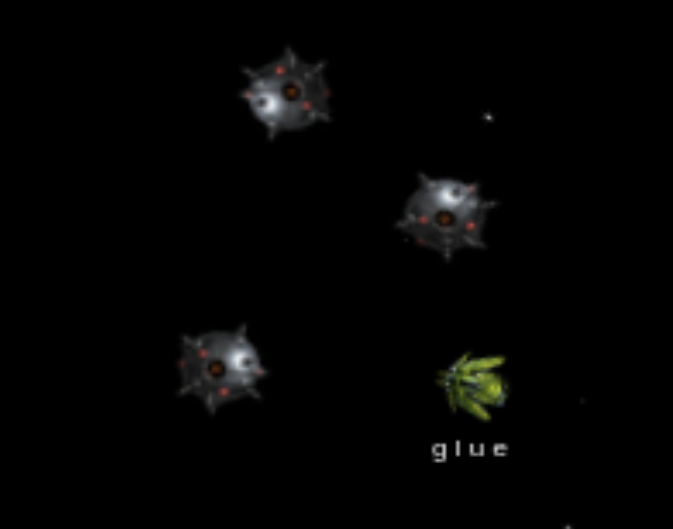

### Charge

The secondary attack that is achieved by holding the fire button for some time. This can insta-kill unless players have a health upgrade. All players have this available at any time. Used for precision one-shot kills, similar to sniping. Meant to be used often.

Units: 1 | Damage: 100 | Secondary

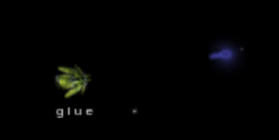

### Skull

The laser given to players that have the skull status. Three lasers. One in the middle, one one the left with an angle, and another one on the right, angled. Each hit does a high amount of damage.

Units: 3 | Damage: 80 | End Game

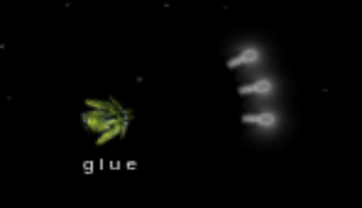

## Icons

Low Health 😰

Self-Destruct 🤯

Confusion 🤡

Burn 🔥

Freeze 🥶

Skull 💀

## The Game

Players move through space and imagery, replacing the images with their own as they see fit.

Players fight each other with the different kinds of lasers.

Some player gets to be dominant and becomes the skull, the other players try to take them down.

They chat among each other globally or more privately in local chat.

They change the music to make the current battles more exciting.

They move through warps, appearing at different parts of the map.

They go to the safe zone to escape danger, to regen, or as a form of AFK.

Players upgrade their health, speed, and lasers as they destroy other ships.

The objectives of the game being: a climb towards skull, taking down skulls, expression through image placement, and chat interactions.

Another objective can be attempting to  destroy the 4 warps before they disappear.

## The Real Game

When using imagination and personal interpretation, the elements and mechanics available in the game allows us to play in different ways.

For instance, warps appear randomly in certain areas, and they have an exit coordinate. This can be interpreted as a trigger related to certain images, and time travel. A warp could appear next to the image of a volcano, with an exit coordinate of 2012, 1938. You could interpret this as you entered a volcano in the year 2012, with an exit tunnel to the year 1938.

Images can be anywhere on the map, they can be of any nature, which can be interpreted in a personal or not so personal way by players. Each image can be its own situation, world, context, ambient, challenge, hideout.

Deciding to go AFK on top of a certain image can have meaning to players. They might decide they want to live inside that kind of world for a while.

The local chat feature allows more private communication with other players that decided to also AFK in that spot, allowing shared experiences and the discovery of secret areas.

The spores being able to go through warps can be said to mean that spores can travel through time.

The 7 stages of the safe zone can define eras or states.

Sudden warps appearing in the middle of tough situations can be considered as lucky escape points.

## The Synthesizer (Theory)

On top of the game, an AI system reads every input, action, interaction, outcome, lucky or unlucky situations, funny or impressive actions. It uses this data to imagine a reality the users can later immerse themselves into, to watch their game unfold in an entertaining way, or in the form of an interactive experience. This combines the ability of modern AIs to interpret symbols, and their ability to produce media.

## The Tool (Theory)

Quantum physics might make intention an actionable force on the state of reality. Focusing on symbolic actions, involving the travel through imagery, and other manifestations from the player, can create focus and energy that exerts a change in your life at some point in time, or at some other level, if your being exists as a fractal or spiral. You could  then use this as a way to produce positive changes in your life, through movement, actions, and transitions, to make it more exciting, or even survive.

## The Commander (Theory)

This can be used in a multi-node organism where each component of the self gets to exert their vote on what is to happen next. It allows autonomous control that suggests a will towards certain places, and combat decisions. It could be used as direct orders, or as suggestions to consider. This includes controlling yourself remotely, for survival, life enhancement, or as an enthropy device to fight boredom and stagnation.