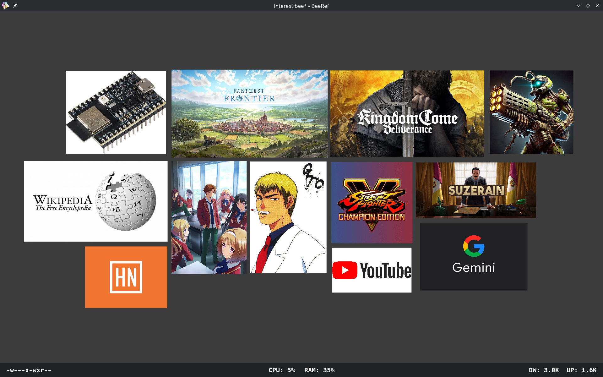

# BeeRef

For a long time I've been feeling like something was missing regarding managing my interests. Sometimes I discover something nice, could be a video game, could be an anime, or a website, or just an interest in learning to do something, and the best I do is acknowledge that I'm interested in keep revisiting this in the future, but without making it more concrete. I needed something that could remind me later what is it that I'm currently interested in, as suggestions to engage in those activities instead of staring blanky at a screen, idle. So I decided to make a system where I could input the interests when I discover I like them, so I could be reminded of them, but without needing much, if any interaction with the system at all for this to work. I decided against text reminders, no matter what kind of algorithm I would use to ease gentle reminders it's still too dry and cerebral, and feels like orders. So I decided to use images, I would find a nice image for each activity, topic, site that I liked and arrange it in a canvas, allowing me to move, resize, arrange the images as I see fit. Gemini suggested 2 programs that would work for this, `pureref`, and `beeref`. I picked `beeref` because it's open source, and I'm glad because it works great.

Here's how it looks after adding some images:

I can just drag and drop images from my browser onto it and it imports them automatically.

I can resize, move, rotatate, mirror, the images, place them wherever I want.

I can zoom in/out the canvas, move around, it's basically infinite.

Everything is saved in a single `interest.bee` file, which is currently `2.7mb`.

So now when I decide I want to "subscribe" to an activitiy I just find a nice image to represent it and put it on the canvas somewhere.

And I can leave this open and glance at it from time to time, to slowly and naturally get reminded and excited about things I like or should do, and eventually when I get the energy and determination I engage in one of them.

As things add up I can also use this as a memory tool, images of niche websites, books, whatever I think I should dig deeper into from time to time, without this I might forget a lot of those, this acts as visual bookmarks.

The `.bee` file can be easily shared, and maybe there's some ways to enable real time collaboration with multiple people.