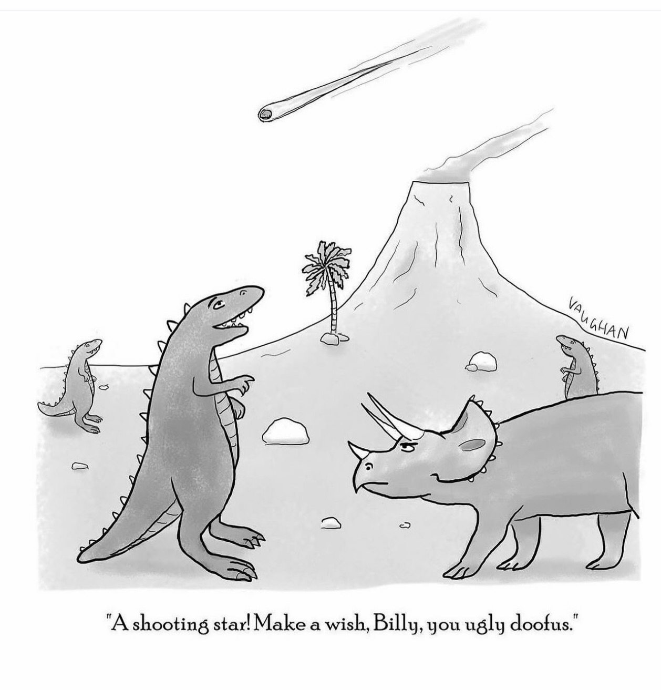
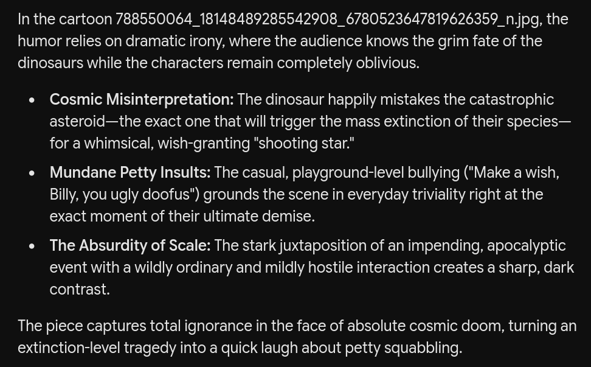
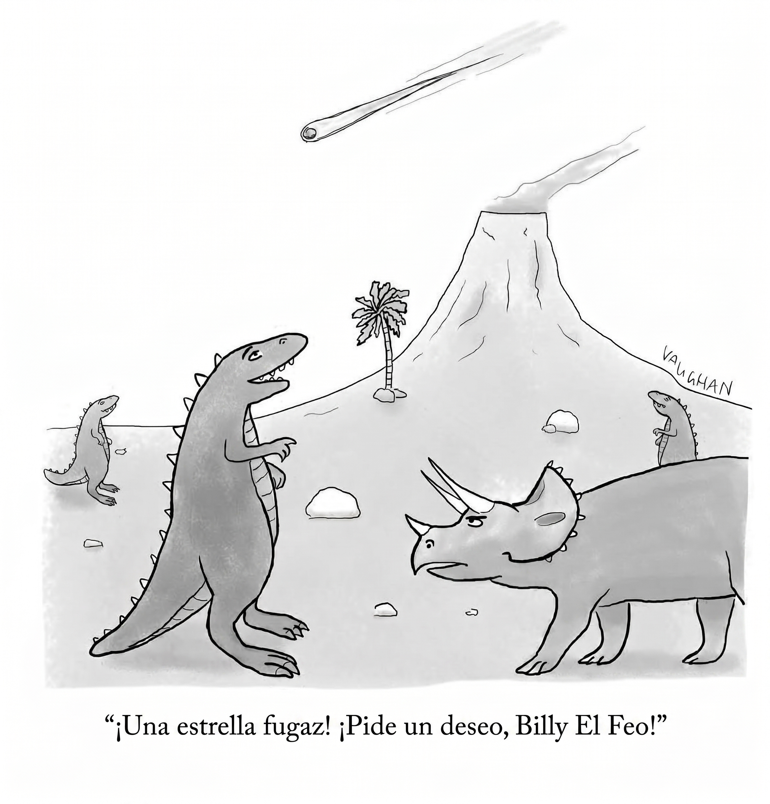

# Make a wish, Billy

I've been having a lot of fun with this image today. On the surface it appears like a harmless boomer cartoon, something you'd dismiss as `cute`, or `meh`. But it actually has 2 layers of irony. The first layer is that it's funny because they think it's a shooting star, and they act silly, thinking it's just another day, go on make a wish you doofus haha. That's actually what most of the AIs I tried concluded, they think that the whole joke is how wholesome and silly the thing is once you know the context about the `Chicxulub` asteroid that made dinosaurs extinct.

This is what `Gemini 3.1 Pro` had to say:

However there is a second layer, and only `gemini-3.7-flash` caught it. The joke is the wish itself. Billy clearly looks pissed off, in that instance he is being called `ugly` and a `doofus`. We don't know how long this bullying has been happening, we don't know if it was a bad day for Billy, but something is bothering him, and he was given the opportunity to make a wish, to wish anything at all. Look at his face, what do you think he is gonna wish? He is being called ugly and dumb (in a cute way) and if you notice, he's the only triceratops, the whole world are T-Rex, making fun of him, he probably feels alone and angry, what do you think he's gonna wish for? He wished for the extinction itself, or something to that effect. The asteroid is already there, which can prompt people to find flaws in the logic, but it's not a logical joke, the fun is what the image made you think about in the moment, the subtext, the dark comedy which I suspect the author did intend to include. Gemini said Billy probably wished for that particular T-Rex's demise, but the wish got misunderstood or overblown and it ended up destroying all the dinosaurs, that's just another interpretation out of the same comedic opportunity the image provides, but the point is that the wish is central to the real joke.

I posted this on reddit and most of the people didn't catch the joke either. The downvotes and upvotes involved heavily attacked my interpretation of it. But others did catch it as well. Some found it funny how most AIs did get that wrong; I suggested maybe they're pretending not to get it to avoid being flagged with a weird personality, thinking it might be a trait of the psychopathy spectrum, but actually I read this later:

### Detecting the subtext of dark humor signals a cognitive profile characterized by high abstract and verbal intelligence, robust Theory of Mind (mentalizing capacity), and rapid conceptual frame-shifting, enabling the brain to resolve complex incongruity and decode pragmatic intent. Personality-wise, it aligns with high Openness to Experience, a low Need for Cognitive Closure, and low Neuroticism (high emotional regulation), which allows the individual to maintain psychological distance and process taboo concepts analytically through a benign violation framework rather than reacting with immediate affective distress or moral rigidity.

So maybe those that are not getting it are the psychopaths.

Also maybe `gemini-3.7-flash` is just better at analyzing images and understanding nuances.

---

I made a spanish version if you want to share that:

