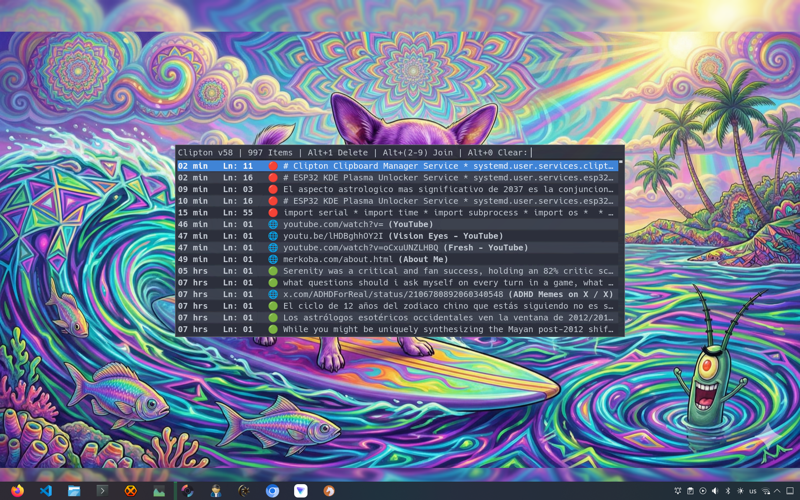

# Clipton

This is a clipboard manager I made some years ago, and I ended up using it A LOT, multiple times a day.

Clipboard managers are useful because they allow me to store text I copied recently, which I can use later by placing it in the clipboard again. This way I can copy something, copy another thing, then copy the first thing 2 hours later.

This is useful in the moment, but also hours or days later, to find something you used some time ago and recover it, which sometimes might be the only way of not losing something for good.



## What's nice about Clipton?

It's a single python file (1063 lines). It uses a watcher daemon which can be started as a systemd service, and then it simply keeps working in a lightweight and fast manner, without getting in the way.

I can quickly type something to filter what I'm looking for.

I added colored icons to show when something is multi-line, single-line, or a URL.

It fetches URL titles which are displayed, this helps a lot, especially on youtube videos. The titles themselves are not copied when used.

It allows Deleting an item (Alt+1), Joining items (Alt+2-9), and Clearning everything (Alt+0).

It allows configuration through a `~/.config` file.

It shows how long ago an item was copied, so you know if you used it recently or some hours ago.

It shows how many lines the item has.

So it's simple but highly practical.

## Other people are using it

I know at least a guy apart from me that is using it.

Hopefully he can just grab the code and adapt it to his needs.

The code is [here](https://github.com/madprops/clipton).

I recently moved to `nixos`, so maybe this will help:

```nix
  inputs = {
    ...
    clipton.url = "git+ssh://git@github.com/madprops/clipton.git";
    ...
```

```nix
  home.packages = [
    ...
    clipton-pkg
  ];
```

```nix
  systemd.user.services.clipton = {
    description = "Clipton - Clipboard Manager";
    wantedBy = [ "graphical-session.target" ];
    after = [ "graphical-session.target" ];
    serviceConfig = {
      ExecStart = "${pkgs.clipton}/bin/clipton watcher";
      Restart = "on-failure";
      RestartSec = 5;
    };
  };
```