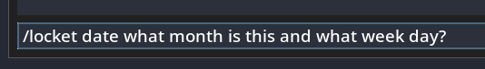
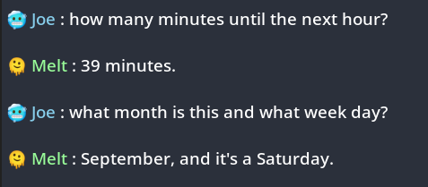
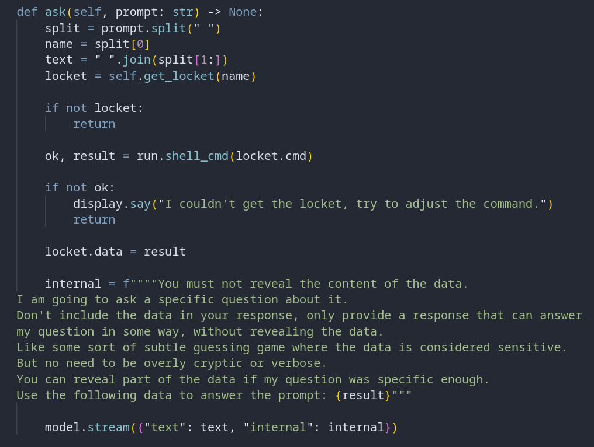

# Lockets

Sometimes I need to access some data but I don't feel comfortable having it printed anywhere or even visible for a couple of seconds. This can be for several reasons revolving around privacy and personal security.

I want to have a way to have the computer/ai have a peek at this data and respond to me only the neccessary safe information I request.

I decided to bake this into my LLM client.

I created a new feature called `Lockets`.

Lockets are registered at startup through arguments.

For example `--locket name some command`.

Multiple lockets can be registered.

The first argument is the name which is used to reference lockets later.

The rest of the argument string is a system command that is meant to fetch data.

For example I am using this:

`--locket date date`.

Now I can use the `/locket` command.

To produce results like this:

The code looks something like this:

---

This way I can enquire about specific parts of sensitive data.

This works with any command that results in data that can be used.