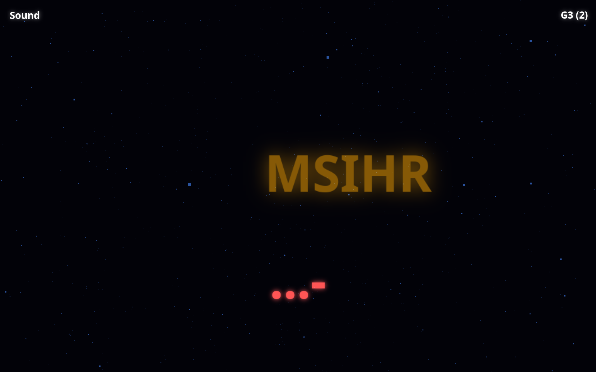

# Mall Code

Mall Code is a multiplayer game for morse code communication.

Every player is in a zone at a certain speed.

For instance a player can be in `G1` which is the slowest zone.

Or `G9` which is the fastest zone.

There are other zones apart from `G`.

The faster zones are closer to the real normal morse code speed.

The slower zones are for newbies.

The speed of the zones determine the delays that consider the input a letter or word.

Each zone has 9 files which can be accessed with `U`.

For instance `U8` would would fetch the 8th asset of the current zone.

---

The only input accepted in the game is a single signal which is either a dot or a dash. This can be any keyboard signal or mouse button.

The `HUD` contains a button to toggle beep sounds, an indicator with the current zone name, and the number of players connected to that particular zone.

On the left there are the last 10 nouns typed in that zone. Which are words that are at least 3 chars in length that exist in a nouns list.

---

The current letter formed by players is shown in white, and after another delay, the composed word is shown in yellow.

---

There is a 3 second lock for players to not be interrupted, by taking control of the morse code input, 3 seconds after the last signal sent. During this period players can't control the morse code input. After the lock is over, any player can start using it.

---

https://mall.merkoba.com/

https://github.com/madprops/mallcode