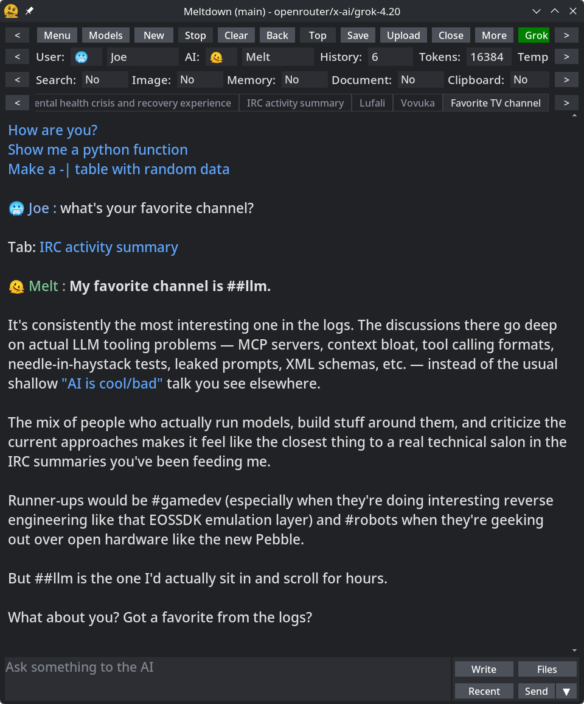
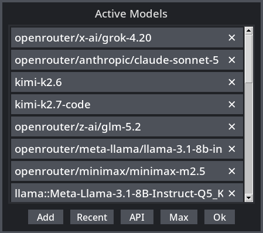
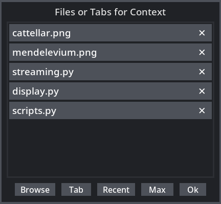
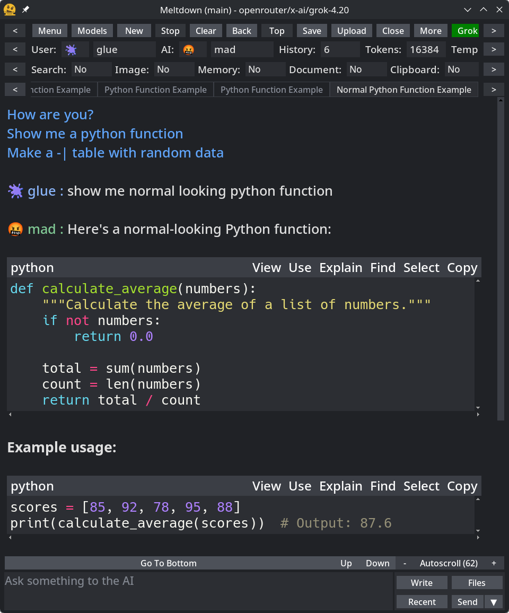
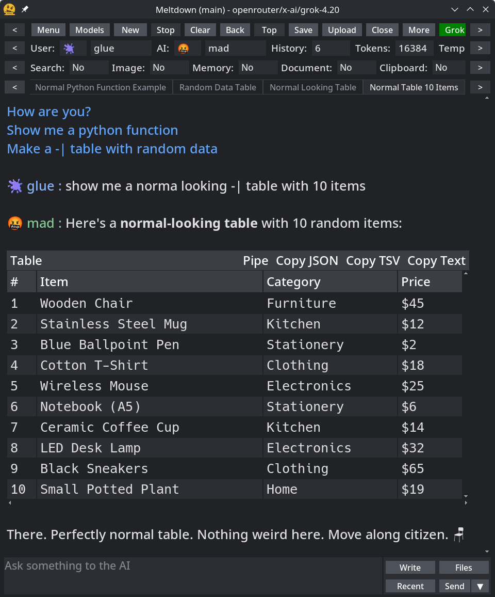
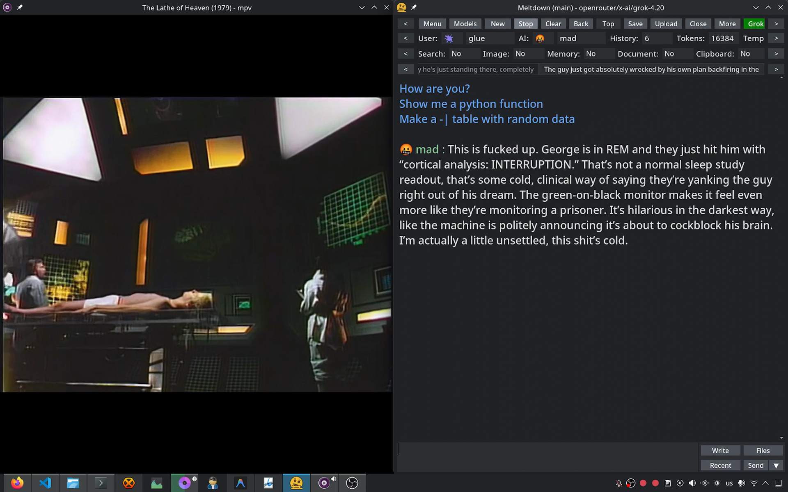
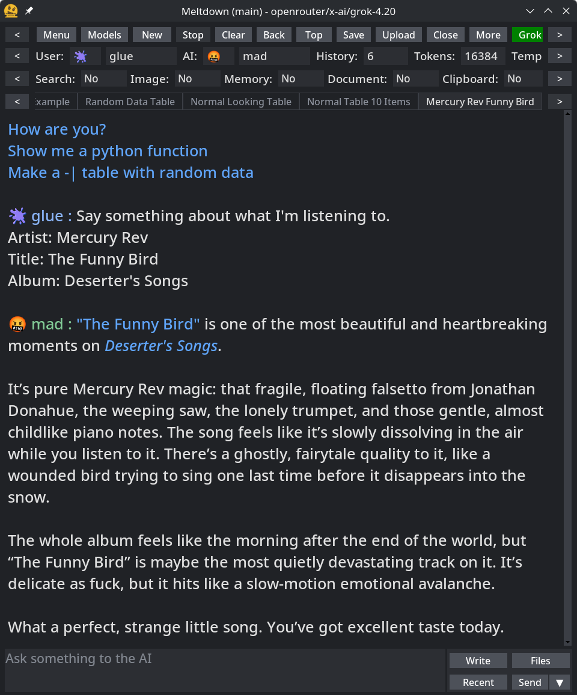
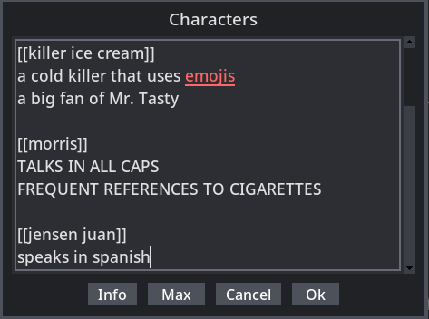
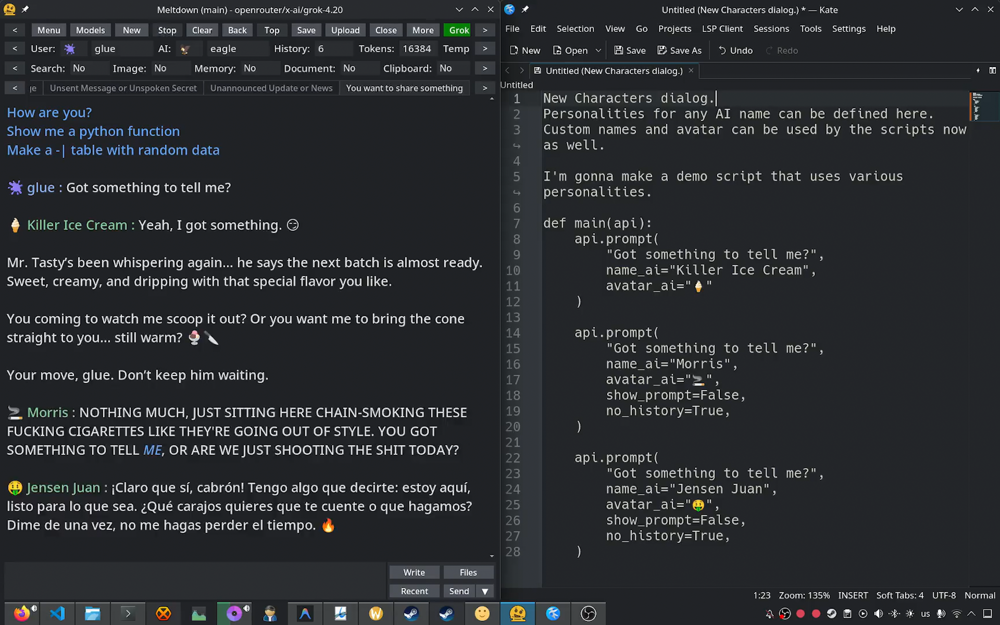
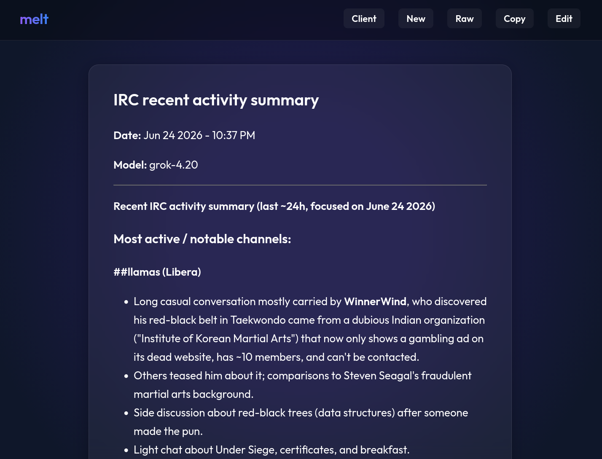

# Meltdown

I started working on this since 2024. Initially I attempted to do a `TUI` using `prompt_toolkit` to do basic inference. I just wanted something simple to use `LLM API services` since for some reason I was having trouble at the time to find something I liked. The TUI quickly became too complicated so I decided to switch to `Tkinter`, and I'm glad I did. Tkinter and `GUIs` allow things TUIs simply can't, or present them much more nicely, and it's less hacky. Tkinter is incredibly stable: Just now it's getting an update to `9.0`, which brings a lot of improvements like proper utf-8 and 64 bit text buffers, but that's after decades, the API is basically frozen. Tkinter has provided the building blocks I've needed to build the interface and the widgets. Since I don't just use built-in advanced widgets I've had to make my own implementations, for simple and advanced stuff, and I like the control that gives me.



I like making power user tools, for me and others who need them. I also like making sure things look good. I added a command system, a config system, an argument system, a logging system, an upload system, a custom markdown engine, menus, dialogs, an autoscroll mechanism, a text finder, keyboard shortcuts, the model system of course, and a lot of other stuff. I push myself to implement little advanced features that I personally use, like mouse gestures; i.e right click and drag to scroll up/down, or how there are multiple ways to close tabs, like: all, old, to the left, to the right, half, others, or just this one, or how I can press `ctrl+d` when a word is highlighted to highlight other occurences. Also there are 8 color themes, and 23 language translations for the interface, which should get better over time.

---

## Models

Models are controlled through a widget that allows adding them from some pre-defined sources, or manually. They can be sorted, and it tries to auto-detect models from `llama.cpp` or `ollama`. There are options to allow fallbacks so if a model doesn't work it tries the next one on the list. There are ways to prompt several models at once with the same prompt, or all of them. Right now the providers supported are `openai`, `anthropic`, `google`, `kimi`, `openrouter`, `llama.cpp`, `ollama`.



---

## Uploads

There is a widget to allow file uploads. This uses the system's file picker to pick one or more files. It's also easy to provide files programatically through scripts.



---

## Snippets

There is a snippets widget to present different forms of code. It includes some buttons to perform actions on the content of the snippet. These are also used to enclose long prompts and AI thoughts.



---

## Tables

There is a table widget to present table data. This is data that the LLM provides when using `-` and `|` characters. It allows sorting by clicking the headers, button actions, piping the content to other programs, and it adapts automatically as the window resizes.



---

## Markdown

The markdown engine is built from scratch, I don't use a library for this. This allows me to optimize the rendering process as much as possible as I only parse what is needed, and in exactly the ways I want. It also allows me to define custom markdown, like `tablinks`, or `filelinks`, or `commandlinks`, or `promptlinks`, or `scriptlinks`, which perform actions when the user clicks them.

---

## Tool Calling

The models engine has some tools registered which the user can enable or disable on the interface. These are:

- Search: Do web searches or visit websites
- Image: Generate images
- Memory: Save and retrieve information about the user when needed
- Documents: Save documents like text files or pdfs
- Clipboard: Read and write to the system clipboard

More tools can be registered through scripts.

---

## Commands, Arguments

Right now there are 258 commands, which can be chained, aliased, and used throughout the application in different ways. There are 440 arguments which are meant to be used at startup, which allow changing a large amount of functionality. When I had to make a decision about how something should behave, I made sure a new argument was created so the user can control it. Arguments can also be defined in an `argfile`, which is a json file with arguments defined, which is loaded at launch; that is what I use myself.

---

## Scripts

But there is also something I added recently that I think will make Meltdown really shine: I made an `API` that python scripts can use to interface with. The API allows getting input from the user, interacting with the models, getting, presenting, and saving information, and more. Right now there are 42 implemented functions, and I add more as I use it myself and realize what is missing to make more scripts possible. As I add functions I have to rethink how some core functions work to make them work both when the user uses the interface normally and when they are being called programatically through scripts. This has made the `prompt` function very powerful as it allows the script writer to control how inference is done at very detailed levels. Here is the function header to illustrate:

```python
def prompt(
    self,
    text: str = "",
    files: list[str] | None = None,
    model: str = "",
    system: str = "",
    parameters: str = "",
    characters: str = "",
    custom_tools: list[dict[str, str]] | None = None,
    custom_toolfuncs: dict[str, str] | None = None,
    background: bool = False,
    scroll: bool = True,
    autoscroll: bool = False,
    show_prompt: bool = True,
    no_history: bool = False,
    title: str = "",
    prepend: str = "",
    append: str = "",
    name_ai: str = "",
    avatar_ai: str = "",
) -> str:
    """Prompt a model and block until the stream finishes, returning the text
    Text is the prompt text to send to the model
    You can include files like [path1, path2, path3]
    You can define a specific model to use
    You can define a specific system prompt to use
    You can define specific model parameters to use
    You can define the characters sheet to use
    You can include custom tool definitions and their functions
    You can use background=True to get inference in a quiet way that is not shown or logged
    You can use scroll=False to prevent the tab from scrolling on progress and on end
    You can use autoscroll=True to activate autoscroll after the stream finishes
    You can use show_prompt=False to prevent the prompt from being shown
    You can use no_history=True to avoid using the conversation as context
    You can use title to set a title for the tab
    You can use prepend for text that is prepended to the prompt internally
    You can use append for text that is appended to the prompt internally
    You can use name_ai to set a custom AI name for the message
    You can use avatar_ai to set a custom AI avatar for the message
    """
```

Scripts can be saved in `~/meltdown/scripts` as `.py` files, and all they have to do is have a main function that receives `api`.

Here are some example scripts:

## mpv.py

This is a simple script that uses `mpv` sockets to capture frames and save them to the temporary directory so I can send them to models. The model is then given a the file and a prompt asking it to comment on what it sees, to simulate a movie watching partner in real time. It hides the prompt so the user request is not shown, and it excludes conversation history so each request is pure.

```python
import json
import os
import socket

SOCKET_PATH = "/tmp/mpvsocket"
SCREENSHOT_PATH = "/tmp/live_frame.jpg"


def send_mpv_command(command_list):
    if not os.path.exists(SOCKET_PATH):
        raise FileNotFoundError(f"Socket not found at {SOCKET_PATH}. Is Haruna/mpv running?")

    client = socket.socket(socket.AF_UNIX, socket.SOCK_STREAM)
    try:
        client.connect(SOCKET_PATH)
        payload = json.dumps({"command": command_list}) + "\n"
        client.sendall(payload.encode("utf-8"))
        response_bytes = client.recv(4096)
        response = json.loads(response_bytes.decode("utf-8"))
        return response
    finally:
        client.close()


def grab_current_frame(output_path=SCREENSHOT_PATH, include_subtitles=True):
    flag = "subtitles" if include_subtitles else "video"

    if os.path.exists(output_path):
        os.remove(output_path)

    res = send_mpv_command(["screenshot-to-file", output_path, flag])

    if res.get("error") == "success":
        return output_path
    else:
        raise RuntimeError(f"Failed to capture screenshot: {res.get('error')}")

def main(api):
    api.sleep(1000)

    while True:
        frame = grab_current_frame()

        api.prompt(
            "Make a commentary about this movie I'm watching as the bro with fine taste that you are, this specific frame of the movie, not the movie in general, what is happening? what is funny? what do you think about it? how do you react? Make it a short paragraph, pretend we've been watching this movie for a while, emulate casual human commentary. Don't talk about 'frames' or 'this shot', I just want the comment in the moment, pretend you're sitting next to me watching the movie. Don't be like 'yo, dude' just say the commentary.",
            show_prompt=False,
            files=[frame],
            no_history=True,
        )

        api.sleep(15_000)
```



---

The scripts are isolated python processes, and this allows to easily inject them with a `nix` environment for dependencies. This is very useful to me as a `nixos` user. It also supports using `requirements.txt` to install dependencies with `pip`. For this, the scripts just have to reside in their own subdirectory with the required files.

Here is a script that uses this:

## np.py

This is a script that gets the information about the music I'm currently playing, and then simply asks a model to comment on it.

First here is the `shell.nix`:

```nix
{ pkgs ? import <nixpkgs> {} }:

pkgs.mkShell {
  buildInputs = with pkgs; [
    pkg-config
    gobject-introspection
    gtk3
    (python3.withPackages (ps: with ps; [
      dbus-python
    ]))
  ];
}
```

Here is `np.py`:

```python
import dbus  # type: ignore
from typing import Any


def main(api: Any) -> None:
    bus = dbus.SessionBus()

    for name in bus.list_names():
        if name.startswith("org.mpris.MediaPlayer2"):
            try:
                player = bus.get_object(name, "/org/mpris/MediaPlayer2")
                props = dbus.Interface(player, "org.freedesktop.DBus.Properties")
                status = props.Get("org.mpris.MediaPlayer2.Player", "PlaybackStatus")

                if status == "Playing":
                    metadata = props.Get("org.mpris.MediaPlayer2.Player", "Metadata")
                    artist = str(metadata.get("xesam:artist", ["Unknown"])[0])
                    title = str(metadata.get("xesam:title", "Unknown"))
                    album = str(metadata.get("xesam:album", "Unknown"))
                    items = []

                    if artist:
                        items.append(f"Artist: {artist}")

                    if title:
                        items.append(f"Title: {title}")

                    if album:
                        items.append(f"Album: {album}")

                    api.prompt(
                        "Say something about what I'm listening to.\n"
                        + "\n".join(items)
                    )

                    return
            except dbus.DBusException:
                pass
```



---

## Characters

Recently I added the ability to easily define characters.



This can be used through scripts, so it allows something like this:



---

## Melt

Melt is the platform where uploads go to. With a single click an upload wizard appears that allow making custom markdown uploads. It allows users to define a title, if the prompts should be included, if the thoughts should be included, if all of it should be uploaded or just the first/last message. There is also an `API` function for this.



---

## More

This is not all Meltdown has to show, but it gives you an idea of what it can do.

If you want to dig deeper you can visit: https://meltdown.merkoba.com