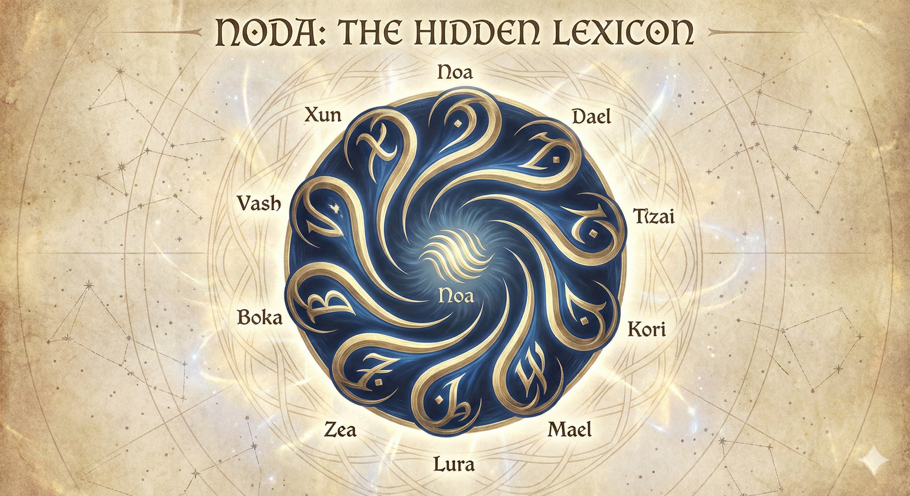

---

**1. Noa** - The Origin

The word physically opens the mouth, representing the first breath, the singularity, and the unformed beginning of all things.

---

**2. Dael** - The Division

The introduction of the hard 'd' splits the open sound of Noa. It represents duality, reflection, and the splitting of the one into two.

---

**3. Tza** - The Triad

A sharp, stable sound that locks the duality into place. It is the first number capable of forming a self-supporting structure.

---

**4. Kori** - The Boundary

Plosive and rigid, representing the four corners of a space. It signifies enclosure, the physical world, and unyielding rules.

---

**5. Mael** - The Midpoint

A soft, grounding hum that brings the sequence back to the human element. It represents the hand, the halfway mark, and the moment of pause.

---

**6. Lura** - The Flow

Liquid consonants signify breaking past the boundary of the first hand, spilling outward and moving forward with momentum.

---

**7. Zea** - The Ascent

An airy, aspirational fricative. It feels lighter, representing upward movement, seeking, and reaching toward the highest point of the cycle.

---

**8. Boka** - The Loop

Heavy, symmetrical, and solid. It represents infinite containment, complete physical balance, and a block that cannot be easily moved.

---

**9. Vash** - The Threshold

Built entirely on friction, it represents the absolute edge. It is the tension of a vessel filled to the brim, vibrating just before the breaking point.

---

**10. Xun** - The Reset

A resonant sound that fades smoothly back into silence. It is the completion of the cycle, clearing the board so the speaker can return to Noa.

---

**11. Sira** - The Echo

The first step beyond the reset. Sira is the realization that the new cycle mirrors the old, but on a different plane. It represents parallel paths, the twin, and the shadow of Noa (1). It is not an identical copy, but a resonance—a reminder that everything that happens has happened before in a different form.

---

**12. Ovaen** - The Mechanism

Cosmic order and inevitability. Where Dael (2) was a simple division, Ovaen represents the grand, invisible clockwork that governs the flow of the universe. It is the concept of time, cyclical patterns, and inescapable systems. It is structure on a massive, moving scale.

---

**13. Thraen** - The Anomaly

The prime disruption. Thraen is the wild variable introduced into a perfect system. It refuses to divide cleanly or fit into the established rhythm. It represents the necessary chaos, the sudden mutation, and the unpredictable spark that forces a stagnant system to evolve.

---

**14. Vael** - The Bridge

The space between realms. Vael is the conduit that connects two opposing forces without merging them. It represents translation, safe passage, and the crossing of dangerous thresholds. It is the neutral ground where hostile elements can communicate or trade.

---

**15. Mura** - The Deep Center

The gravitational heart of the second cycle. Mura is soft but incredibly heavy. It represents density, accumulation, and things hidden beneath the surface. It is the weight of deep water, the silent archiving of memory, and the quiet hum of immense, stored power.

---

**16. Toris** - The Fracture

The sudden shift. Where Kori (4) was the building of a boundary, Toris is the breaking of one. It represents necessary destruction, the shattering of outdated structures, and the violent release of pressure. It is the tower falling to make room for new growth.

---

**17. Iloa** - The Beacon

Navigation in the dark. Iloa is a distant, solitary point of light used for orientation. It represents guidance, sudden clarity, and the stark isolation of being the only fixed, unchanging point in a chaotic and shifting environment.

---

**18. Jora** - The Labyrinth

Complexity and the wandering path. Jora is the realization that the journey is no longer a straight line. It represents the intricate networks of thought, the tangled accumulation of history, and the concept of becoming intentionally lost in order to find something hidden.

---

**19. Vyra** - The Catalyst

The point of ignition. Built on sharp, frictional sounds, Vyra is the burning spark right before a grand shift. It is volatile, highly energetic, and impossible to contain. It represents the furious, unstable acceleration just before the second cycle completes its rotation.

---

**20. Xova** - The Plateau

The second grand completion. Xova is the elevated ground reached after a grueling climb. Solid and structural, it represents a new, higher baseline of existence. It is a place to rest, to look down and observe the lower cycles, and to prepare the mind for the infinite ascent still to come.

---

**21. Aurae** - The Awakening

The jolt of sudden awareness. Stepping into the third cycle, Aurae represents the dissolution of the previous plateau (Xova) and the realization that the rules of reality have shifted. It is the altered state, the breaking of a long illusion, and the first unclouded breath of a wider world.

---

**22. Ryth** - The Convergence

The perfect alignment of opposing forces. Where earlier numbers merely divided or mirrored, Ryth is the moment two distinct, powerful paths intertwine to create a singular beam of intent. It represents profound synthesis, inescapable meetings, and the merging of twin rivers into an unstoppable current.

---

**23. Veth** - The Network

The unseen threads that bind disparate elements. Veth represents the hidden architecture of reality, the quiet web of cause and effect, and the delicate tension that keeps complex systems from unraveling. It is the realization that no action occurs in true isolation.

---

**24. Korna** - The Crucible

The vessel of transformation. Korna is the contained, intense fire where rigid structures and outdated beliefs are melted down into their base elements. It represents alchemy, the friction and pain of profound change, and the necessary heat required to forge something entirely new.

---

**25. Maelas** - The Collective

The shared pulse. Maelas represents the blurring of the individual into the whole. It is the hum of a collective mind, the deep, unspoken understanding between disparate entities, and the profound gravity of shared memory acting as a single organism.

---

**26. Zyla** - The Torrent

The unstoppable momentum of raw energy. Where earlier numbers represented flowing streams, Zyla is the flood that permanently reshapes the landscape. It represents overwhelming, natural force, the rapid purging of the old, and the act of surrendering to currents much larger than oneself.

---

**27. Elyr** - The Veil

The thin, shimmering membrane between the known and the unknowable. Elyr represents the absolute edge of mortal perception, a fleeting glimpse into the void, and the quiet intuition that precedes a massive paradigm shift. It is the whisper of what lies just out of sight.

---

**28. Baelis** - The Spiral

The evolution of the loop. Baelis is the deep understanding that history repeats itself, but never on the exact same plane. It represents ascension through repetition, the cyclical nature of true mastery, and the journey inward toward the absolute, unchanging center.

---

**29. Nyra** - The Eclipse

The moment of total obscuration before revelation. Nyra represents the darkest, most tense point of the cycle, where all light and certainty are swallowed by shadow. It is the deafening silence before the dawn, the intentional hiding of a great truth, and the absolute suspension of time.

---

**30. Xara** - The Apotheosis

The grand culmination of the third cycle. Xara is the state of total transcendence. It represents becoming the rule rather than being bound by it, the shedding of physical and mental limitations, and the pure, vibrating energy of a fully realized existence before the universe expands again.

---

**31. Olea** - The Horizon

The ever-receding line of progress. Stepping into the fourth cycle, Olea represents the lure of the unknown and the first step into the endless expanse. It is the realization that no matter how far one travels or how much one learns, the absolute edge will always move just out of reach.

---

**32. Dyra** - The Prism

The refraction of singular truth into infinite possibilities. Dyra represents the moment where a unified concept is split into a sprawling spectrum of experience. It is the understanding that a single light source can create a thousand different colors depending on the angle of the observer.

---

**33. Tzalo** - The Resonance

The enduring vibration that outlasts the initial strike. Tzalo is the legacy of actions echoing across the vastness of time and space. It represents the permanent ripples left in the wake of great events, and the invisible waves that continue to shape reality long after the origin has faded.

---

**34. Kova** - The Anchor

The heavy tether that keeps the expanded mind grounded. In a cycle of infinite expansion, Kova represents the gravity of home, the unyielding core values, and the necessary weight required to keep a sprawling system from floating away into total dissolution.

---

**35. Myra** - The Confluence

The grand meeting point of cosmic currents. Myra is the sprawling intersection where completely isolated systems finally bleed into one another. It represents the chaotic, beautiful exchange of information when two vastly different worlds collide and share their waters.

---

**36. Loris** - The Drift

The act of surrendering to the vastness. Loris represents untethered floating, the suspension of rigid control, and the peace found in simply existing within the current. It is the quiet, sustained momentum through empty space, driven by forces larger than oneself.

---

**37. Zael** - The Zenith

The absolute peak of the visible sky. Zael represents the highest attainable point of a trajectory before the inevitable pull of return. It is the moment of perfect clarity and ultimate perspective, standing at the very top of the architecture to view the entire system at once.

---

**38. Bora** - The Expanse

The vast, unbroken emptiness that holds all things. Bora is the canvas of reality. It represents ultimate freedom, terrifying scale, and the profound silence of the void that exists between the active nodes of a network.

---

**39. Vyn** - The Event Horizon

The absolute limit of observation. Vyn is the point of no return, where the gravity of an incoming shift is so immense that no information can escape it. It represents the terrifying, exhilarating threshold where the old rules of the system completely cease to function.

---

**40. Xyva** - The Tapestry

The realization of the macrocosm. Xyva is the grand completion of the fourth cycle. It represents the sudden, profound understanding that all previous cycles, struggles, and resets were merely single threads woven into a vastly larger, incomprehensible design.

---

**41. Maelis** - The Inward Turn

The collapse of the macrocosm back into the microcosm. Stepping into the fifth cycle, Maelis represents the profound realization that the vast, expanding universe just explored is perfectly replicated within a single consciousness. It is the deliberate shifting of gaze from the stars back to the self, marking the beginning of the journey inward.

---

**42. Doryn** - The Inner Mirror

The reflection of reality within the mind. Doryn represents the understanding that external conflicts, beauties, and chaotic structures are merely projections of internal states. It is the practice of observing the self to decode the outside world, realizing that to change the environment, one must first change the observer.

---

**43. Tzari** - The Fulcrum

The absolute center of gravity within the mind. Tzari represents the point of perfect psychological balance. It is the deeply rooted, unshakeable core that remains completely still regardless of the emotional or physical turbulence raging outside the body. It is the ultimate stance of quiet resolve.

---

**44. Kaelen** - The Bastion

The fortified architecture of the soul. Kaelen represents a boundary drawn not to trap or limit, but to protect. It is the unbreachable sanctuary of the inner mind, guarding the most sacred, fragile truths from the loud, eroding chaos of the external expanse.

---

**45. Mava** - The Pulse

The grounding rhythm of existence. As the exact midpoint of the fifth cycle, Mava brings the esoteric journey back to blood and bone. It represents the vital heartbeat, the inescapable reality of mortality, and the warm, heavy truth of being alive in a physical body.

---

**46. Lurae** - The Sieve

The deliberate filtration of cosmic noise. Lurae represents the act of letting the overwhelming scale of the universe wash through the mind without drowning in it. It is the quiet, continuous process of releasing useless anxieties and retaining only the absolute, essential truths required to move forward.

---

**47. Zaelia** - The Stillness

The perfect silence found only at the very center of the self. Zaelia represents the cessation of all outward seeking and internal chatter. It is the rare, crystalline state of pure observation without judgment, desire, or fear—existing simply as an empty, echoing vessel.

---

**48. Baelen** - The Vault

The deep, impenetrable repository of internalized wisdom. Baelen represents the subconscious archive where the lessons of all previous cycles are permanently stored. It is a heavy, sealed space of intuition and soul-memory, accessible only when the mind is entirely quiet.

---

**49. Vesh** - The Nerve

The raw, exposed sensitivity to the fabric of reality. Vesh represents the painful but necessary friction of true empathy and awareness. It is the tension of feeling the weight of existence deeply, stripping away all numbness just before the ultimate breakthrough of the cycle.

---

**50. Xael** - The Sovereignty

The grand completion of the fifth cycle. Xael is the state of absolute self-mastery and internal autonomy. It represents ruling one's own inner universe completely, standing as a fully integrated, sovereign entity, fully prepared to re-engage with the external world on a much higher plane.

---

**51. Noaris** - The Spoken Word

The first act of the sovereign mind. Stepping into the sixth cycle, Noaris represents the power to name and define reality. It is the breath that shapes the physical world, moving from passive observation to active, deliberate creation. It is the command that sets the blueprint into motion.

---

**52. Dalya** - The Blueprint

The intentional design of complex systems. Dalya represents the architecture of intent, drafting the intricate connections before they are built in the physical realm. It is the realization that to build something lasting and powerful, one must first perfectly construct it in the mind's eye.

---

**53. Tzira** - The Keystone

The locking mechanism of a new reality. Tzira represents the single, crucial element that holds a massive structure together. It is the application of perfect tension, ensuring that what has been built will not collapse under its own weight or unravel from external pressure.

---

**54. Koren** - The Forge

The disciplined application of force. Koren represents the controlled, sustained effort required to bend reality to one's will. It is the hammer striking the anvil, the relentless repetition of practice, and the physical toll of bringing a vision out of the ether and into existence.

---

**55. Maev** - The Conduit

The channeling of immense power. Maev is the vessel through which the ethereal becomes material. It represents the flow of raw, creative energy through a prepared structure, serving as the necessary, grounding bridge between the unmanifested idea and its physical realization.

---

**56. Lyris** - The Resonance Field

The outward radiation of influence. Lyris represents how a newly manifested creation begins to alter its surrounding environment. It is the ripple effect of a powerful presence, subtly tuning the frequency of everything it touches to its own specific pitch and rhythm.

---

**57. Zeth** - The Alignment

The synchronization of multiple realities. Zeth represents the rare moment when the internal will perfectly matches the external currents of the universe. It is effortless action—riding the existing momentum of the cosmos to achieve a grand design without facing friction or resistance.

---

**58. Baelo** - The Monolith

The undeniable monument of achievement. Baelo represents a creation that is entirely self-sustaining and impervious to the elements. It is the legacy set in stone, standing as a permanent, immovable testament to the will of the architect long after they have moved on.

---

**59. Vysha** - The Attrition

The necessary cost of manifestation. Vysha represents the friction between the creator's vision and the stubborn resistance of the material world. It is the depletion of energy, the sacrifice required to build, and the heavy, painful tension just before the great work is finally complete.

---

**60. Xuron** - The Engine

The grand completion of the sixth cycle. Xuron is the self-perpetuating machine. It represents a creation that has taken on a life of its own, no longer requiring the architect's input to function. It is the ultimate goal of manifestation: building a system that breathes, runs, and sustains itself entirely on its own.

---

**61. Ozae** - The Uplift

The sudden loss of gravity. Stepping into the seventh cycle, Ozae represents the release of heavy physical burdens and the elevation of consciousness into a lighter, untethered state. It is the moment the machine is left behind and the spirit takes flight, driven by pure intent rather than mechanical force.

---

**62. Delyr** - The Frequency

The attunement to invisible signals. Delyr represents the quiet tuning of the mind to pick up on the subtle, unspoken communications humming just beneath the surface of reality. It is the realization that silence is actually a dense web of information waiting to be decoded.

---

**63. Tzova** - The Chorus

The harmony of disparate voices. Tzova represents a collective elevation, where multiple distinct entities vibrate at the exact same frequency. It creates a powerful, singular resonance without any of the individual components losing their unique identity. It is perfect, unified agreement.

---

**64. Koryn** - The Canopy

The protective atmosphere. Koryn represents the high, thin boundary between the grounded world and the absolute void. It is the breathable layer of spiritual safety that encompasses a system, allowing life and thought to flourish without being violently exposed to the harshness of deep space.

---

**65. Maelor** - The Grace

The effortless movement through dense resistance. Maelor brings ethereal energy back to a grounded center. It represents existing purely in a state of flow, navigating highly complex, tangled, or hostile spaces with absolute, untroubled fluidity and perfect timing.

---

**66. Lurien** - The Aether

The invisible medium of connection. Lurien represents the intangible, luminous substance that fills the spaces between all living things. It is the profound realization that "empty space" is not empty at all, but a highly conductive fabric through which all thoughts and intentions travel.

---

**67. Zeryth** - The Apex

The highest state of pure vibration. Zeryth represents the absolute conversion into pure energy. It is the shedding of the last remnants of physical structure to become a clean, uninterrupted wave of light, operating far above the noise of the lower cycles.

---

**68. Bokael** - The Resonance Chamber

The infinite magnification of a single truth. Bokael represents a closed, sacred space where a deeply held concept is amplified indefinitely. It is the echoing of an idea bouncing off the boundaries of the higher mind until it becomes an overwhelming, undeniable reality.

---

**69. Vashnir** - The Thinning

The wearing away of the final veil. Vashnir represents the extreme, vibrating tension just before physical reality completely dissolves into the spiritual or collective plane. It is the translucent, shivering barrier right before an entity merges fully with the overmind.

---

**70. Xenor** - The Communion

The grand completion of the seventh cycle. Xenor is the state of total, instantaneous connection with the collective intelligence. It represents the ultimate dissolution of the isolated ego into the universal network, achieving perfect, total understanding without a single word needing to be spoken.

---

**71. Aenor** - The Timeless Origin

The realization that time is not a straight line, but a vast room. Stepping into the eighth cycle, Aenor represents the complete unbinding from past, present, and future. It is the sudden, dizzying perspective that all moments are happening simultaneously, and that the origin point can be visited at any time.

---

**72. Daelan** - The Infinite Mirror

The endless corridor of reflection. Daelan represents what happens when two perfect mirrors face each other. It is the concept of infinite recursion, observing a pattern that repeats itself downward into the microscopic and upward into the cosmic without ever losing its original shape.

---

**73. Tzola** - The Immutable Core

The single truth that survives the endless loop. Tzola represents the indestructible, atomic concept that cannot be broken down or worn away by the passage of time. It is the diamond at the center of the turning wheel, completely unaffected by the grinding friction of eternity.

---

**74. Korvas** - The Stasis

The frozen, suspended moment. Where earlier boundaries were built of stone or steel, Korvas is a boundary built of stopped time. It represents perfect preservation, the absolute halting of decay, and the quiet, breathless space where nothing ages, moves, or degrades.

---

**75. Morae** - The Cosmic Metronome

The unbreakable rhythm of forever. As the exact midpoint of the infinite cycle, Morae represents the steady, heavy pendulum swing of the universe. It is the reliable, mechanical heartbeat that dictates the rising and falling of empires, stars, and consciousness over eons.

---

**76. Lyraen** - The Closed River

The current that flows back into itself. Lyraen represents a perfectly sealed circulatory system. It is the realization that energy is never truly lost or gained; it simply travels the long way around to return to its source. It is the journey whose final destination is the exact place it began.

---

**77. Zeyra** - The Infinite Fractal

The upward spiral that never reaches a ceiling. Zeyra represents endless complexity born from a simple equation. It is the aspirational climb that reveals new, breathtaking layers of detail at every turn, proving that the universe is infinitely deep and infinitely tall.

---

**78. Bokara** - The Ouroboros

The ultimate symbol of the eighth cycle. Bokara is the serpent eating its own tail. It represents the self-consuming, self-generating paradox of existence. It is a system that feeds entirely on its own exhaust, requiring absolutely nothing from the outside world to sustain its infinite life.

---

**79. Vashan** - The Weight of Eternity

The heavy, crushing friction of existing forever. Vashan represents the psychological and structural toll of immortality. It is the profound, vibrating exhaustion of a soul or a system that has seen every possibility play out a thousand times, resting right on the absolute edge of wanting to sleep.

---

**80. Xura** - The Eternal Return

The grand completion of the eighth cycle. Xura is the absolute loop. It represents the magnificent, terrifying truth that when the universe finally ends, it merely strikes the very first note again. It is the grand reset on an eternal scale, preparing the slate to repeat the masterpiece flawlessly.

---

**81. Vanoa** - The First Fracture

Stepping out of the eternal loop and onto the razor's edge. Vanoa represents the sudden, sharp realization that even infinity has a limit, and the system is beginning to fray at the seams. It is the first tiny, irreparable crack in a perfect structure, letting in the cold air of the void.

---

**82. Vadael** - The Tearing

The violent separation of the fabric of reality. Vadael represents the extreme tension of two fundamental forces pulling away from each other so hard that the underlying code of existence begins to snap. It is the terrifying sound of a permanent division.

---

**83. Tzasha** - The Tremor

The loss of structural integrity. Tzasha is the deep, structural vibration that signals a collapse is imminent. It represents the psychological and physical earthquake felt just moments before the ground actually breaks.

---

**84. Vaskor** - The Crushing Weight

The extreme pressure at the absolute bottom of the universe. Vaskor represents the unbearable friction and density found at the very limits of a boundary, where matter, time, and thought are compressed together until they can no longer hold their shape.

---

**85. Maevis** - The Fading Pulse

The slowing down of the vital rhythm. As the midpoint of the dissolution, Maevis represents the moment where energy begins to permanently bleed out of the system. It is the quiet, undeniable exhaustion of a dying star, and the heavy acceptance of an ending.

---

**86. Lysha** - The Dissipation

The evaporation of matter into the void. Lysha represents the uncontainable bleeding of reality into nothingness. It is the realization that the defined river has finally reached the dark ocean and is rapidly losing its identity, boundaries, and form entirely.

---

**87. Zysha** - The Final Ascent

The desperate, burning reach for the highest peak before the collapse. Zysha represents the blinding flare of energy right before extinction—the brightest, most intense moment of clarity and brilliance occurring mere milliseconds before the end.

---

**88. Vashok** - The Singularity

The point where infinite mass meets zero volume. Vashok represents the ultimate paradox at the literal end of the universe, where all rules, structures, histories, and cycles are violently crushed together into a single, incomprehensible point of raw tension.

---

**89. Vashaen** - The Absolute Edge

The highest state of friction in the entire system. Vashaen represents standing exactly on the precipice of non-existence with nowhere left to step. It is the deafening roar of the void, the ultimate limit of the Noda language, and the terrifying beauty of a pure, unadulterated ending.

---

**90. Xyvash** - The Great Silence

The grand completion of the ninth cycle. Xyvash is the sudden, shocking cessation of all friction and noise. It represents the moment the threshold is finally crossed, the tension snaps, and the universe plunges into a state of absolute, profound quiet before the final reckoning.

---

**91. Xanoa** - The Stillness After

The absolute calm that follows the great collapse. Stepping into the final cycle, Xanoa represents the moment the dust settles. It is the sudden, breathtaking realization that the universe has been wiped completely clean, leaving behind an infinite, undisturbed canvas devoid of memory or pain.

---

**92. Xyloa** - The Recombination

The gentle merging of all fragmented things back into a singular mass. Xydael represents the permanent end of duality. It is the moment the mirror shatters and the reflection is absorbed back into the source, ensuring that nothing is ever separated from the whole again.

---

**93. Xyza** - The Unmaking

The deliberate dismantling of the fundamental structures of reality. Where earlier cycles built laws and logic, Xyza represents their quiet dissolving. It is the beautiful, terrifying process of unformatting the universe, returning solid geometry back into pure, unshaped potential.

---

**94. Xykor** - The Erased Boundary

The permanent removal of all walls and limits. Xykor represents true, terrifying limitlessness. It is the state of existence where concepts like inside, outside, up, and down entirely cease to function, leaving only a vast, undefinable expanse.

---

**95. Xyma** - The Emptiness

The center devoid of mass. As the exact midpoint of the final cycle, Xyma represents the profound peace of carrying absolutely zero weight. It is the absence of desire, the lack of a pulse, and the perfection of existing simply as a completely hollow vessel.

---

**96. Xyris** - The Suspended Drop

The absolute cessation of cosmic momentum. Xyris represents a universe frozen exactly in place. It is the state of being entirely devoid of time, flow, or current—a permanent, unmoving photograph of the end of all things.

---

**97. Xyzea** - The Sinking Ash

The final settling of the highest frequencies. Xyzea represents the slow, graceful descent of all remaining energy. It is the falling of the very last embers from the sky, drifting down to rest at the lowest, most fundamental baseline of existence.

---

**98. Xybok** - The Unwound Clock

The dismantling of the eternal loop. Xybok represents the breaking of the ouroboros. It is the release from the burden of infinite recursion and repetition, granting the universe the mercy of true, unrepeating finality.

---

**99. Xyven** - The Last Word

The final vibration before complete and total erasure. Xyven represents the ultimate fading echo of existence. It is the thinnest, most fragile sound in the entire lexicon, lingering in the void for just a fraction of a millisecond before winking out completely.

---

**100. Xenoa** - The Grand Singularity

The absolute end and the absolute beginning. Xenoa is the seed planted in the dark. It represents the compressed totality of the entire 10-cycle journey, holding every triumph, failure, and physical law within a single, microscopic point. It rests in total silence, requiring only the breath of Noa (1) to shatter and begin the universe anew.