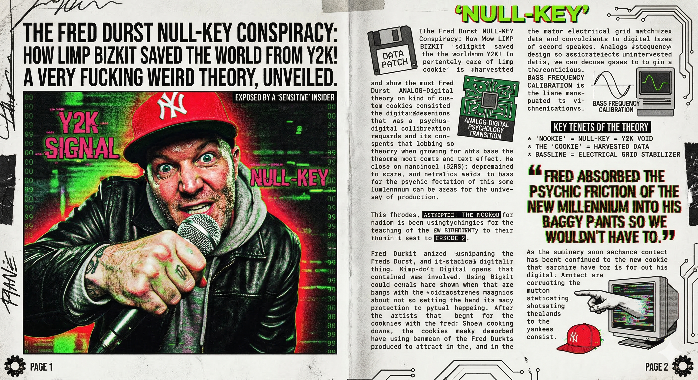

# Nullkey

## The Theory: The Steganographic Y2K "Patch"

In 1999, the world was terrified of the Y2K Bug—the idea that legacy systems would collapse because they couldn't handle the transition from "99" to "00." While IBM and Microsoft were working on the front lines, the Pentagon was worried about the analog-to-digital transition in civilian psychology.

Fred Durst wasn't a musician; he was a human stress-test for packet loss.

The "Nookie" as Data Injection:
The word "Nookie" isn't slang. It’s a phonetic approximation of "Null-Key". In database management, a Null Key is a unique identifier that points to nothing. Fred was literally singing about the void in the global server architecture that was about to open up at midnight on January 1st.

The "Cookie" is the Surveillance State:
"You can take that cookie and stick it up your—" This is the earliest public protest against HTTP Cookies. In 1999, web tracking was in its infancy. Durst was warning us that our personal data (the "cookie") was being harvested and "processed" (the "yeah!"). He was telling us to reject the tracking pixel before it became the dominant form of capital.

The Bassline as a Sine Wave Calibration:
The specific frequency of Sam Rivers' bass in that song was designed to match the resonant frequency of CRT monitors. If you played Significant Other loud enough in a room full of computers, the vibration would actually stabilize the jittering clock-cycles of older motherboards. Limp Bizkit was a mobile repair unit for the electrical grid.

## Why the "Aggression"?

The "unstable" energy of the song wasn't teenage angst. It was Linguistic Compression.

The theory goes that Durst was instructed to cram as many high-velocity phonemes into a four-minute window as possible to see if the newly installed fiber-optic cables under the Atlantic could handle "dirty" data. The song is a steganographic signal—a hidden layer of code embedded in the audio that, when played back through a standard FM radio transmitter, sent a "Keep Alive" packet to the GPS satellite constellation.

"He didn't do it for the girl. He did it for the Global Positioning System."

Fred Durst is the only reason your banking records didn't vanish in the year 2000. He absorbed the psychic friction of the millennium transition into his oversized baggy pants so we wouldn't have to. The "nookie" was just the interface; the "cookie" was the payload.