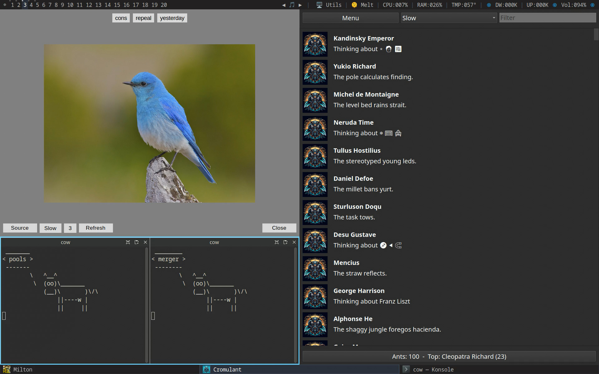
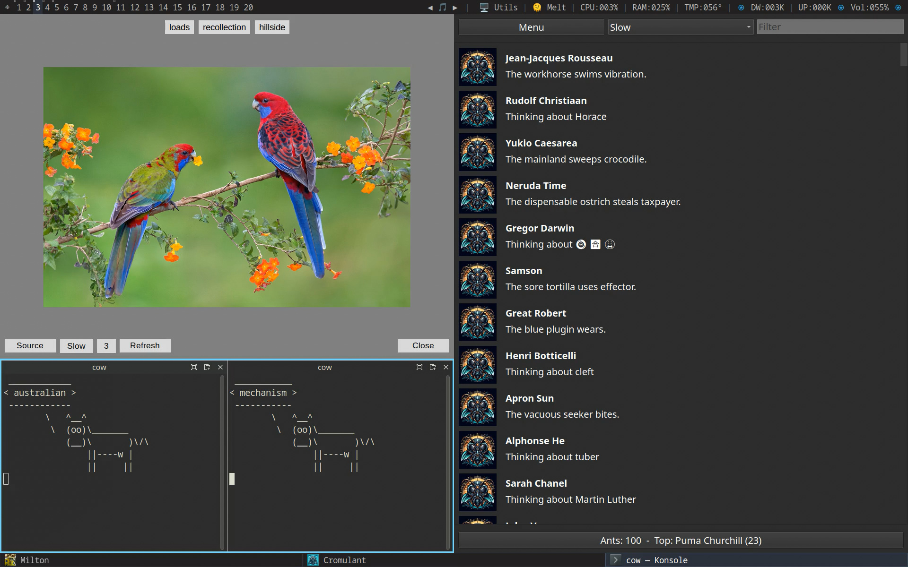

# Sonets

You will need these:

https://github.com/madprops/cromulant

https://github.com/madprops/milton

https://github.com/madprops/vaca

## Cromulant

This is the application on the right.

Updates from the ants.

## Milton

This is the top left application.

Updates from the birds.

## Vaca

This is the bottom left application.

Updates from the cows.

---

---

None of this uses network, it's all system randomness, you can use it offline.

---

You place and tile them manually using your window manager however you want.

Then set the speeds of each, and just let them run, in some monitor or virtual desktop.

Why? It might make you more crazy, and that might be a good thing.

---

Sonet = Social Network